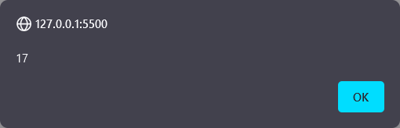
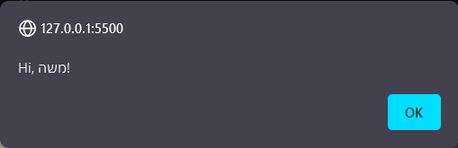
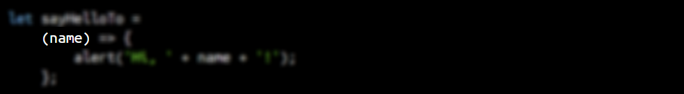
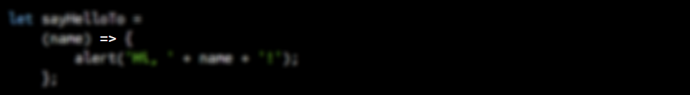
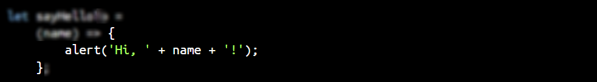
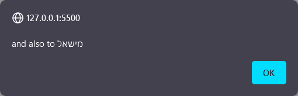
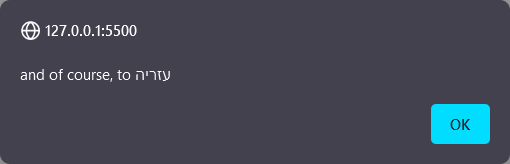
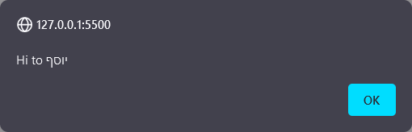
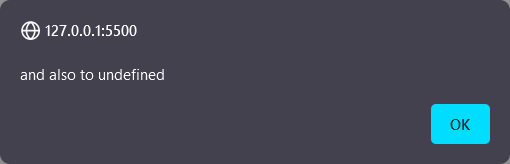
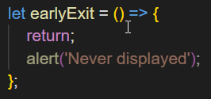

class: center, middle

# פונקציות

---

# מה נלמד

* פונקציות
* העברת מידע לתוך פונקציה
* החזרת מידע מהפונקציה
* פקונציה כערך
* תחביר נוסף לפונקציה

---

# מבוא

פונקציה: **מארז של פקודות**, המאפשרת התייחסות למספר פקודות או חישובים כיחידה אחת.

(פס ייצור המופעל על ידי לחיצת כפתור, במקום לבצע כל פעולה ידנית)

1. **שימוש חוזר** (code reuse) של פעולות הפונקציה
2. **ארגון פעולות התוכנה ליחידות לוגייות** (abstraction)
3. **העברת קוד לביצוע במערכת אחרת** (callbacks, map + filter)

---

# קריאה לפונקציה

מפעילים את הפונקציה ("קוראים" לפונקציה) עם סוגריים עגולים:

```js
alert();
```

תוצאה:

.center[]

---

# העברת מידע לפונקציה

ניתן להעביר מידע בתוך הסוגריים העגולים (**ארגומנטים**) ופעולת הפונקציה תשתנה בהתאם:

```js
alert('Hello');
```

.center[]


```js
alert(17);
```

.center[]

---

# הגדרת פונקציה

```js
let sayHelloTo = 
    (name) => {
        alert('Hi, ' + name + '!');
    };

sayHelloTo('משה');
```

תוצאה:

.center[]

---

# חלקי תחביר

1. רשימת הפרמטרים (**parameter list**) בתוך סוגריים עגולים   
    רשימת שמות (**פרמטרים**) שבהם ניתן להתייחס בתוך הפונצקיה למידע הנכנס
2. .grayed["חץ"]
3. .grayed[גוף הפונקציה (בין הסוגריים המסולסלות) המכילה את פעולות הפונקציה]



---

# חלקי תחביר

1. .grayed[רשימת הפרמטרים (**parameter list**) בתוך סוגריים עגולים]  
.grayed[רשימת שמות (**פרמטרים**) שבו ניתן להתייחס בתוך הפונצקיה למידע הנכנס]
2. "חץ"
3. .grayed[גוף הפונקציה (בין הסוגריים המסולסלות) המכילה את פעולות הפונקציה]



---

# חלקי תחביר

1. .grayed[רשימת הפרמטרים (**parameter list**) בתוך סוגריים עגולים]  
.grayed[רשימת שמות (**פרמטרים**) שבו ניתן להתייחס בתוך הפונצקיה למידע הנכנס]
2. .grayed["חץ"]
3. גוף הפונקציה (בין הסוגריים המסולסלות) המכילה את פעולות הפונקציה



---

class: code-small

# ריבוי פרמטרים

שמות הפרמטרים בתוך רשימת הפרמטרים מופרדות עם פסיק (`,`)

```js
let sayHiToThree = (name1, name2, name3) => {
    alert('Hi to ' + name1);
    alert('and also to ' + name2);
    alert('and of course, to ' + name3);
};
sayHiToThree('חנניה', 'מישאל', 'עזריה');
```

  
  

---

# אי-ספיקת מידע לפרמטר

כמו במשתנה, אם לא נספק ערך לפרמטר מסוים הוא יאותחל עם `undefined`:

```js
sayHiToThree('יוסף');
```

  
  


---

# החזרת ערך

קובעים את הערך ה"מוחזר" מהקריאה לפונקציה עם המילה השמורה `return`:

```js
let getHiTo = (name) => {
    return 'Hello, ' + name + '!';
};
let message = getHiTo('דוד');
alert(message);
```

תוצאה:

.center[]

---

# יציאה מוקדמת מפונקציה

המילה השמורה `return` מאפשרת גם יציאה מוקדמת מהפונקציה, ללא ביצוע כל הפקודות שלה:



VS Code מציג את הפקודות שאחרי ה-return במעומעם

---

# פונקציה כערך

פונקיה היא גם ערך. וכמו כל ערך, אפשר להשם אותה למשתנה

```js
let sayHelloTo = 
    (name) => {
        alert('Hi, ' + name + '!');
    };
let sayHiTo = sayHelloTo;
sayHiTo('שלמה');
console.log(sayHelloTo === sayHiTo); // prints true
```

ואפשר להעביר אותה כארגומנט בקריאת מתודה:

```js
let runFunction = (fn) => {
    fn('מישהו');
}
runFunction(sayHelloTo);
```

---

class: code-small

# קיצור תחביר בהדגדרת פונקציה

* אם יש רק פרמטר אחד לא צריך את הסוגריים העגולים:

    ```js
    let sayHelloTo = name => {
        alert('Hi, ' + name);
        console.log(name);
    };
    ```

* אם גוף הפונקציה מכילה רק פקודה אחת, לא צריך סוגריים מסולסלות, ולא את המילה השמורה return:

    ```js
    let getFullName = (lastName, firstName) => firstName + ' ' + lastName;
    ```
---

# תרגיל כתה — מחשבון עם בדיקות

פתחו את הקבצים index.html ו-code.js ב-VS Code, והפעילו בדפדפן.  
נסו להכניס מספרים לשתי תיבות הטקסט, ולחצו על הכפתורים.  
נסו להשאיר את אחד מתיבות הטקסט ריק, או הכניסו ערכים שאנים מספריים, בדקו שקופץ הודע שגיאה.
פתחו את הקוד, והסתכלו על הפונקציה add:

* מבצע בדיקת תקינות על שתי המספרים
* יוצא מוקדם אם הבדיקה נכשלת
* מכניס את תוצאת החיבור לתוך הפלט

וכן פונקצית subtract, וכן multiply וכן divide. אלא שכל פונקציה מבצעת פעולה מטמטית שונה.

---

# תרגיל כתה — מחשבון עם בדיקות

א. צרו פונקציה בעלת פרמטר אחד. פונקציה זו:

* תבדוק האם הפרמטר הוא מספריי (לפי הלוגיקה הקיימת),
* אם לא, תקפיץ הודעה (שוב, בהתאם לפקודה הקיימת) ותצא מוקדם. במקרה הזה הפונקציה יחזיר false
* אחרת, תחזיר true.

השתמשו בפונקציה הזו כדי לבצע את הבדיקות בתוך add subtract multiply divide

ב. צרו פונקציה שאמורה לקבל פרמטר אחד, שהוא אמור להכיל אחד מהערכים הבאים: `'+'`, `'-'`, `'*'`, או `'/'`. פעולת הפונקציה כדלהלן:

* אם המחרוזת שהתקבלה אינה אחד מהערכים האלה, הדפיסו הודעת שגיאה, וצאו מוקדם.
* ביצעו את הפעולה המטמטית בהתאם לערך שהתקבל כפרמטר
* כתבו את התוצאה לדף (כבפונקציות הקיימות)

שנו את הקריאות לפונקציות add subtract multiple divide לקריאה לפונציה החדשה עם פרמטרים שונים.

---

# שיעורי בית

א. נניח שהגדרנו את המשתנים הללו וערכיהם:

```js
let x = 1;
const advance = n => {
    n = n ?? 1;
    x += n;
};
const reduce = n => {
    n = n ?? 1;
    x -= n;
};
```

מה יהיה הערך של x ארי הקוד הבא?

```js
advance();
advance();
reduce();
reduce();
reduce();
```

---

# שיעורי בית

ב. אם נריץ את הקוד דלהלן:

```js
const threeForwardTwoBack = () => {
    advance(3);
    reduce(2);
};
x = 0;
threeForwardTwoBack();
threeForwardTwoBack();
```

מה יהיה הערך של x?

ג. כתבו פקונציה שמקבלת שתי פרמטרים: מחיר ומע"מ, ומחזירה את המחיר + מע"מ.

ד. TODO
